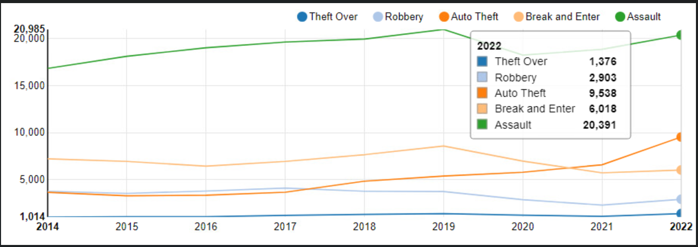
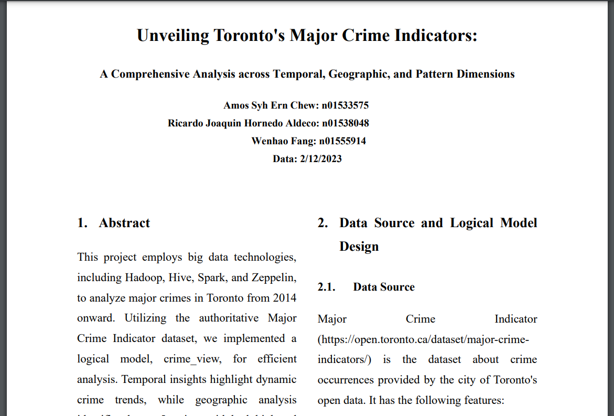

# ITE-5324-BigData-Project

A repository of a project for the course ITE-5324 Big Data 1, Humber Colleage, Winter 2023

- V1:

  - Fix comma issue in dataset
  - Bash command to upload dataset onto Hadoop
  - SQL to create external and internal tables

- V2:

  - Crime features analysis and visualization, using SQL.

- Final_V3

---

- Chart

- Report:
  - **Unveiling Toronto's Major Crime Indicators: A Comprehensive Analysis across Temporal, Geographic, and Pattern Dimensions**
  - doc/Group03_Report.pdf

